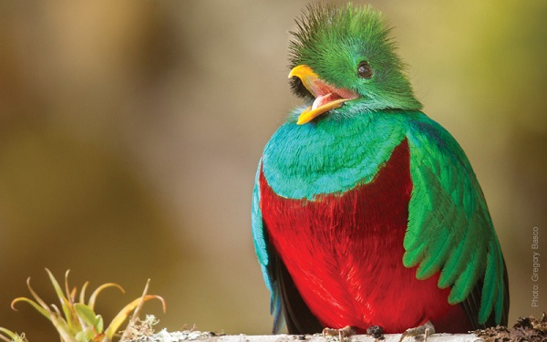

# Hidden-Info
This code that i have developed can be used to encode a message inside of an image.
The algorithm simply works as follows:

- First, I convert the message to its binary representation. Each character in the message
  is converted to their 8 bit representation.
- Then, since each pixel in the image contain 3 data (RGB values), for a given character that
  is 8 bits, I take three pixels each time to encode only one character information and do the
  same things to others. For example, if there are 50 characters inside of the message, I use
  50*3 = 150 pixels to encode the image.
- How do I encode it? I look at the RGB values of the pixel, if I have the bit 1 to encode and
  if the value of the corresponding pixel value is even I make it odd. If I have the bit 0 to
  encode and the pixel value is odd, I make it even.

These are the three steps that I apply.

Note: I have seen the algorithm at this <a href="https://www.geeksforgeeks.org/image-based-steganography-using-python/">side</a>.

  

